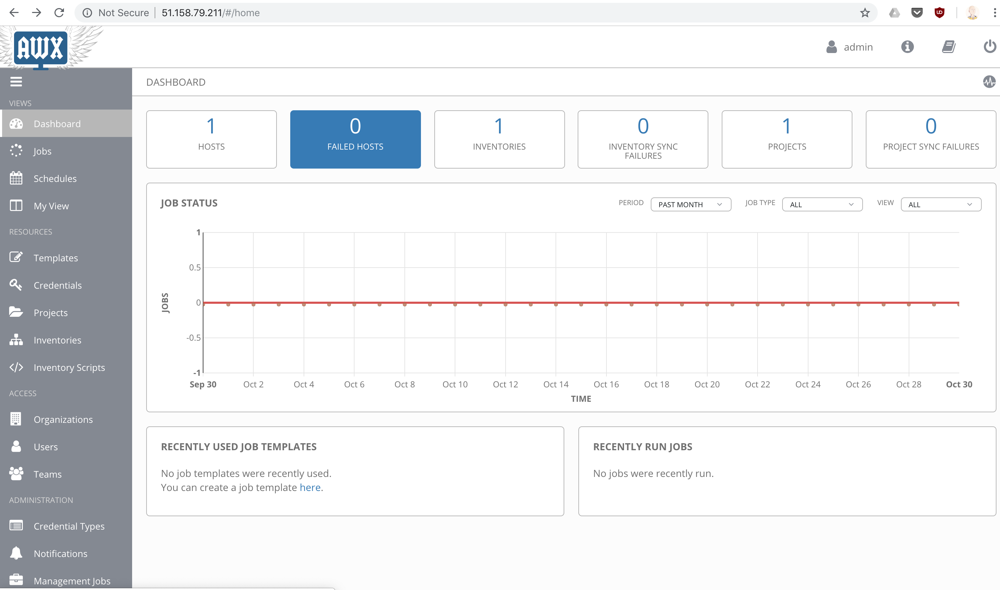

# ansible-sshbastion
Ansible playbooks for managing an SSH Bastion

/Evolve Hackathon 31 10 2018/

/Participants/
Ali Farooqui
Patrick Birchall

## AWX Project managed SSH 
This is a small project to build an AWX console, the open source version of Ansible Tower, that can manage SSH for a small set of static instances. 

This can either be done through certificate based SSH management, or an easier alternative. 

## Prerequisites
We decided to have a single instance for each component we were planning to use. 

1. AWX Master: The first instance would have the AWX components installed locally. This was done using the default docker compose file. This will be the frontend for key management.
2. SSH Bastion: This instance would be responsible for storing the access keys for each of the SSH users. The SSH keys would be deployed using a playbook. 
3. Test instance: This will be the instance users will want to access. 

The infrastructure is spun up on Scaleway instances. The boxes all contain ubuntu 16.04

---

## AWX 
The AWX project is the open source version of ansible tower, sponsored by Redhat. AWX allows ansible playbooks to be deployed with a visual dashboard, role-based access control, job scheduling with inventory management. Here is what our default AWX dashboard looks like. 

Deploying AWX was done using the steps below.

1. Install the dependencies for AWX. This includes installing docker, ansible and all the relevant pip modules.
2. Clone the awx repository. https://github.com/ansible/awx
3. Modify the inventory in `awx/installer/inventory`
4. Run the command from `awx/installer`
`ansible-playbook -i inventory install.yml`

This will set up AWX on port 80. 

---

## SSH Bastion
The AWX console will deploy playbooks. The remote host in this case will be the SSH bastion. 

The bastion will route SSH traffic to hosts, and in this case, have the ability to decide which users get what level of access to these hosts. 

### Setting up the bastion
Set up the CA
`ssh-keygen -f ssh_ca`

Set up the SSH key for the support session  
`ssh-keygen -t ed25519 -C "hackday"`
 
Sign the keypair with the CA
`ssh-keygen -s ssh_ca -I root -n root -V +1d ~/.ssh/id_ed25519.pub`

Check that the key has the right permissions 
`ssh-key -L -f id_ed25519-cert.pub`

Add the ssh_ca.pub onto the host that you want access to with the tag “cert-authority” in front of the public key

SSH into the instance. 
`ssh -v root@51.15.194.41`
  
We have tested and confirmed that 

### Writing the playbook that deploys the role based access control through AWX

With our current method for deploying SSH keys, only users that have access to AWX will be able to deploy SSH.
